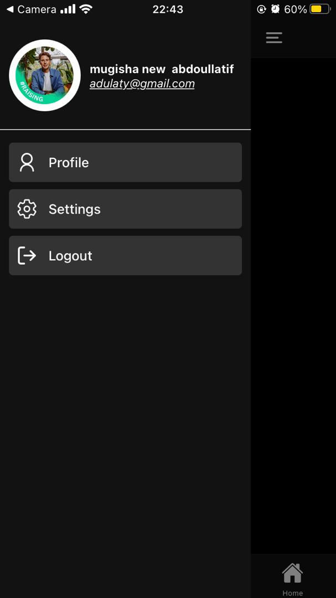
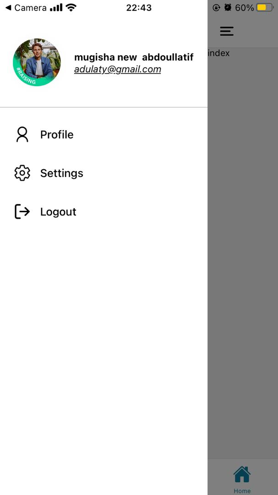
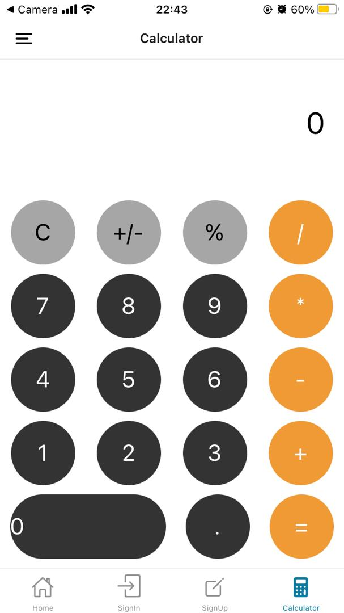
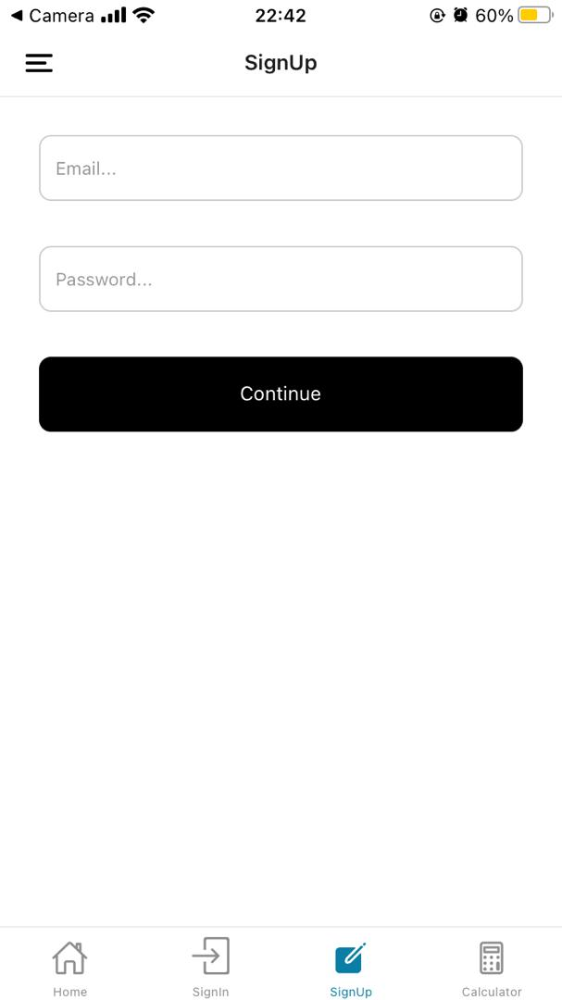
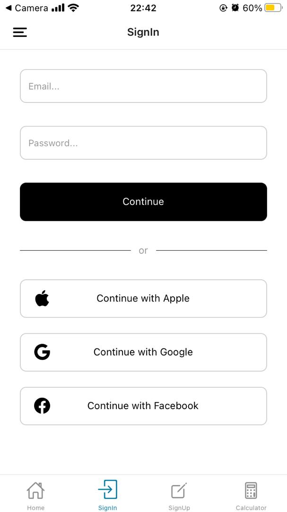
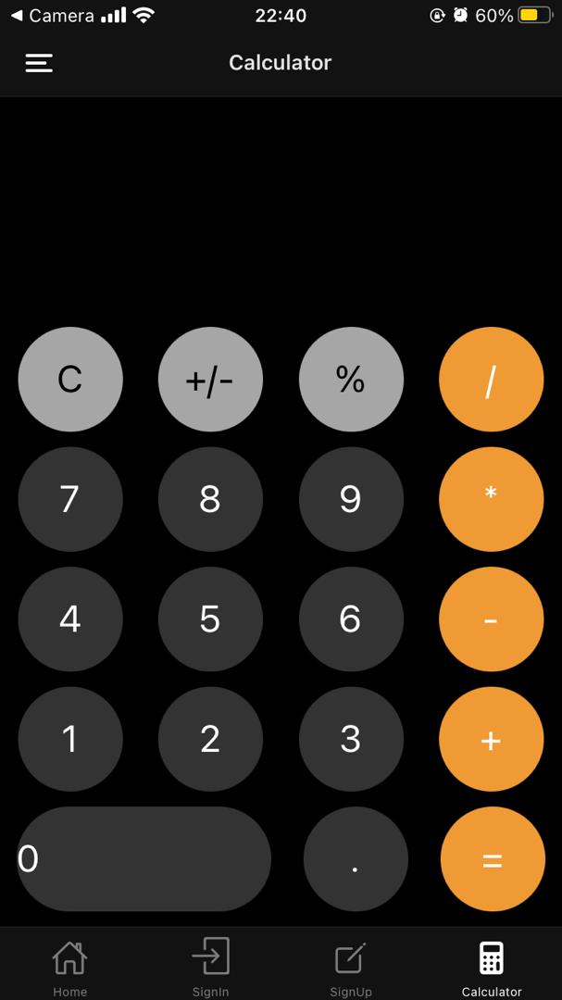
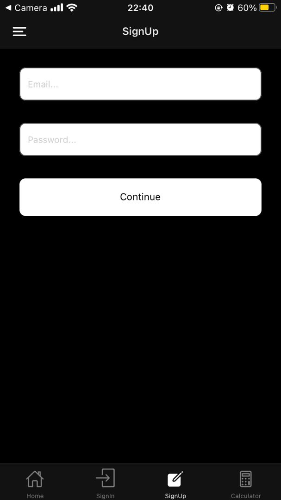
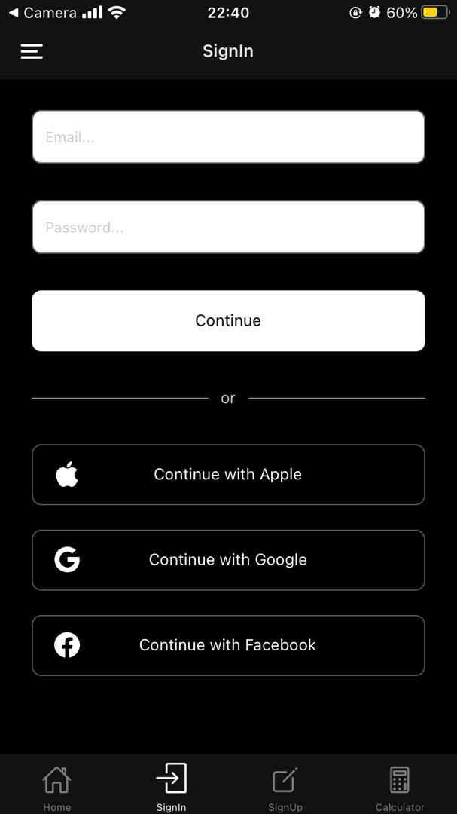

## Getting Started

1. Clone the Repository

   ```bash
   git clone https://github.com/your-username/book-library-app.git
   cd book-library-app
   ```

2. Install dependencies

   ```bash
   npm install
   ```

3. Start the app

   ```bash
    npx expo start
   ```

4. Open the App

   - Scan the QR code with the Expo Go app (available on iOS and Android) to run the app on your mobile device.
   - Alternatively, run the app on an Android/iOS emulator.

## Screenshots









